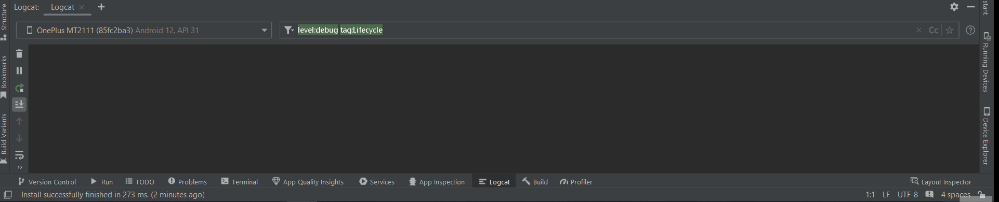

# Примеры работы от 23.03.2024:

## ActivityLifecycle:

## MultiActivity:

## IntentFilter:

## ToastApp:

## NotificationApp:

## Dialog:

## Ответы на вопросы:
1. Будет ли вызван метод «onCreate» после нажатия на кнопку «Home» и возврата
в приложение?
Ответ: нет, не будет, т.к. есть обработка состояний onStop, onStart и onResume.

2. Изменится ли значение поля «EditText» после нажатия на кнопку «Home» и
возврата в приложение?
Ответ: нет, не изменится.

3. Изменится ли значение поля «EditText» после нажатия на кнопку «Back» и
возврата в приложение?
Ответ: нет, не изменится.
